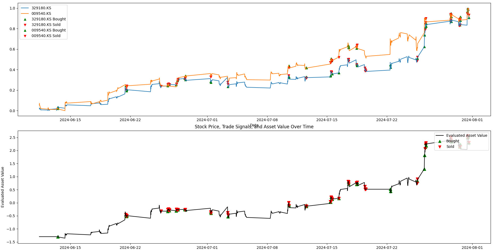
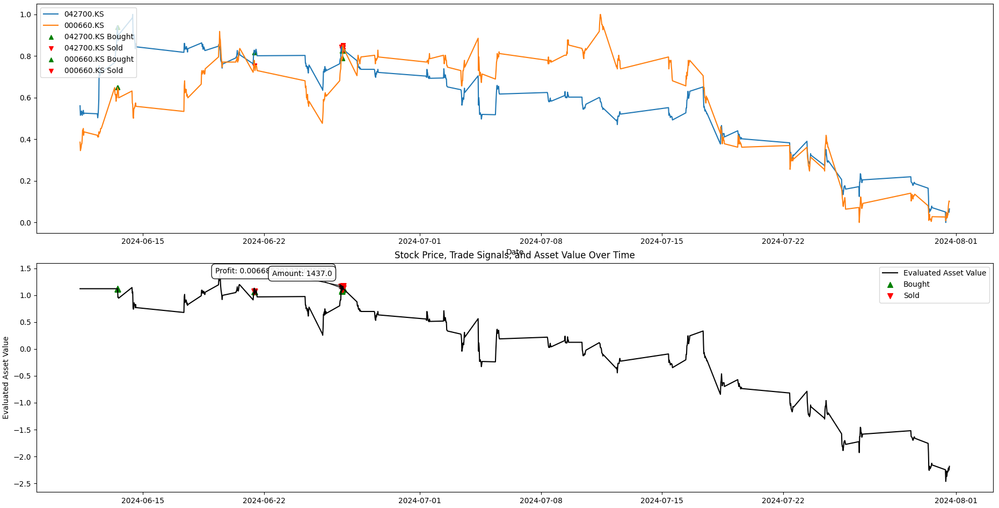
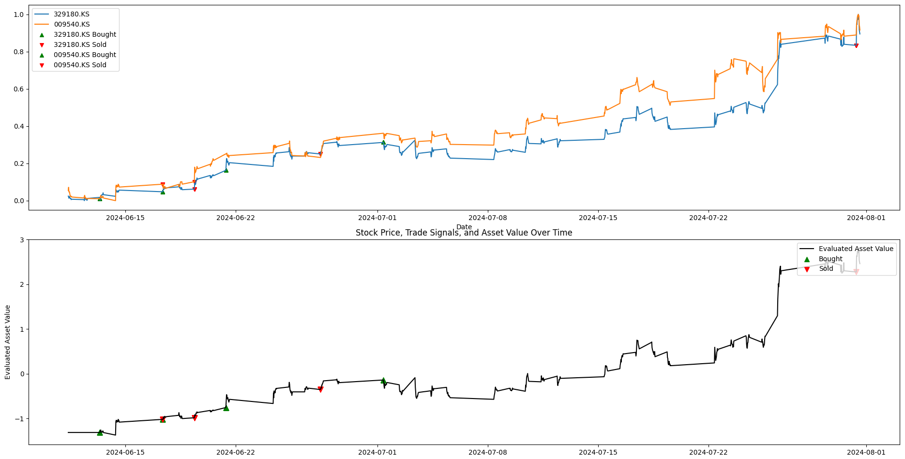
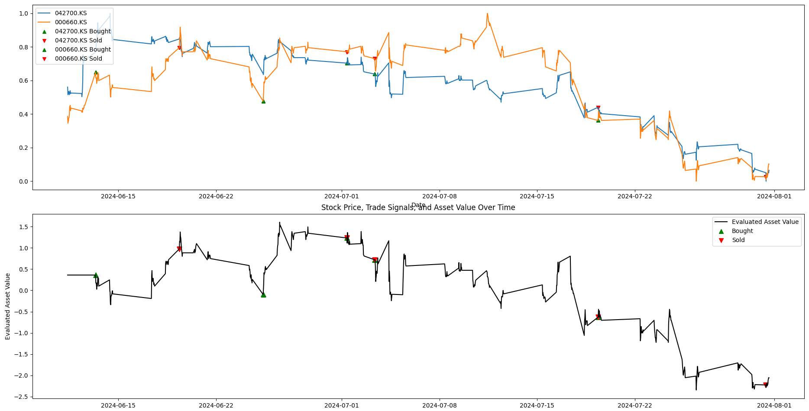

# Plato

# READ ME 읽어주세요.

프로그램을 사용하여 발생하는 모든 손실에 해당하는 것은 실행한 본인의 책임입니다.  
프로그램에 정보를 입력한 후 실행하면, 장이 열리는 즉시 모델들에 의해서 투자가 진행됩니다. 이에 발생하는 손실에 대해서, **저는 책임이 없음을 고지합니다**.
다시 말하지만 **오픈소스로 저의 모델을 공유합니다**. GUI와 TUI, 그 외 모든 프로그램들은 **강제로 설치되지 않으며** 사용자 본인이 **직접 다운로드** 하였으며 API와 관련된 모든 것들 또한 **직접 입력**하였고, 그로 인해 **투자(Invest)를 실행하면 투자가 된다는 것을 인지하셨음을 압니다**.

Any losses arising from the use of the program are the responsibility of the user who executed the program.  
If you enter information into the program and run it, investments will be made by models as soon as the market opens. **Please note that I am not responsible for any losses arising from this**.
Again, **I just share my models as open source**. GUI, TUI, and all other programs are **not forcefully installed** and are **downloaded** by the user themselves, and everything related to the API is also **entered** directly, resulting in **investment**. I know you realize that if you run , you will be making an **investment**.

# Strategies

## Neo strategy

* Commonly **high** profit
* Countermeasures that follow news and **trends**
* Multiple machine/deep learning **models**
* For some stocks decline, **high** loss.
* Needs 30m interval data and make signals every 30m.

### If the stock is rising

### If the stock is falling

## Compound strategy

* Lower plunge damage  
* Higher profit on some stocks
* Needs 30m interval data, but trades once a day.

### If the stock is rising

### If the stock is falling

## Compare Pair Trade strategies

When rising during 2024-06-11 ~ 2024-01-01, Stock pair 329180.KS and 009540.KS
-----------

| strategy | trades | end | best | worst | sharp |
|----------|--------|-----|------|-------|-------|
|Neo|140|48.56%|53.45%|-0.79%|1.29|
|Compound|9|65.90%|73.44%|-0.85%|1.44|

When falling during 2024-06-11 ~ 2024-01-01, Stock pair 042700.KS and 000660.KS
-----------

| strategy | trades | end | best | worst | sharp |
|----------|--------|-----|------|-------|-------|
|Neo|14|-28.78%|2.49%|-31.23%|-1.12|
|Compound|10|-15.45%|7.05%|-18.18%|-0.59|

### Results

Overall, the Compound strategy of day trading appears to be more stable. However, the Neo strategy appears to be better as cash continues to increase by reflecting market conditions through various models.

# Utils

## Preprocess Weights

To prevent the sum of the weights (ratios) from exceeding 1, first divide by the sum of the weights. The weights are then divided by the ratio of the purchaseable amount to the maximum manageable amount to determine the ratio to the manageable assets.
However, weights that are too small can become noise and may be ignored. Through this, the Sharpe ratio increased by about 0.1 and the rate of return increased by about 0%p to 3%p.

# Model

## Technical Trend Predictor

Trend predictor, requires RSI, ADX, Lag(1), MACD to predict trend during 1 hour. At least predicts 58% trends and At the best, almost 98%.

Using trend predictor, Max return 19% -> 25%, Lowest return -9% -> 0%. Also Sharp ratio could be higher.

It is stronger than SMA breaking through strategy.

So far, the predict accuracy over than 55%, it is better than without it.

## Price Predictor

Price Predictor predicts prices, but it is not useful about using only to predict price. but, making trend forecast is useful. 

With Technical Trend Predictor, Price Predictor affect that position.

## Volatility Forecaster

Volatility Forecaster predicts volatility of stocks. To use this model, just pass a raw price dataframe.  
Sometime, it isn't good for some stock pairs.

## News Reader

Read financial news for preventing or helping to buying or selling stocks. (Only positive/negtive)