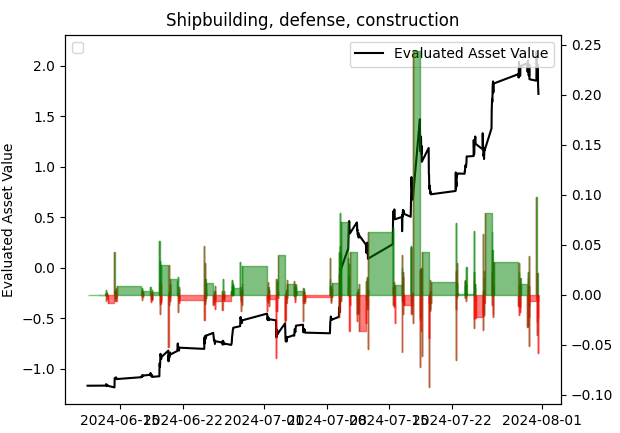
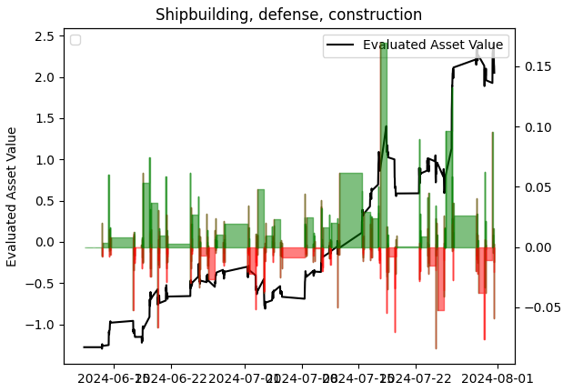
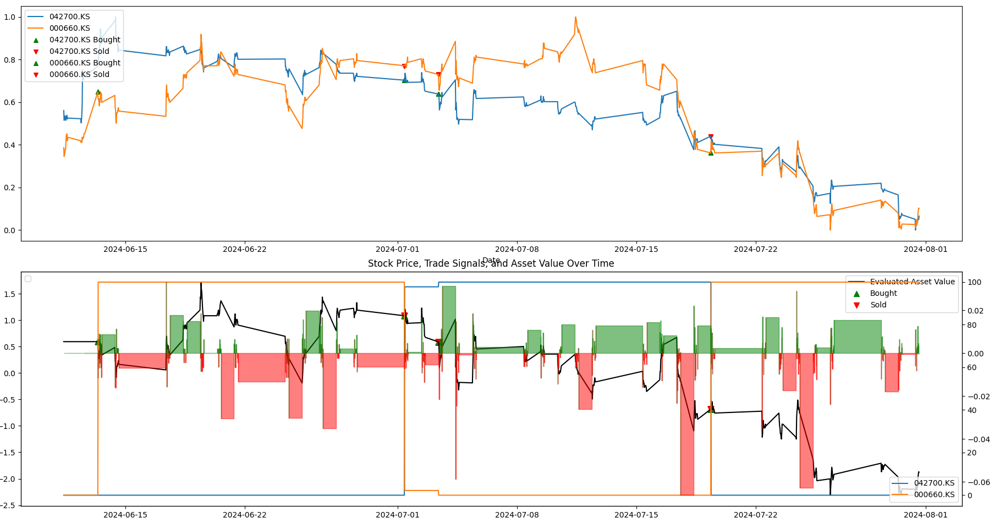
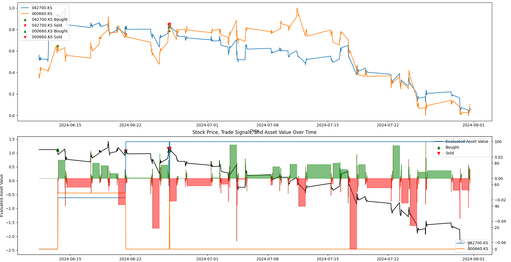
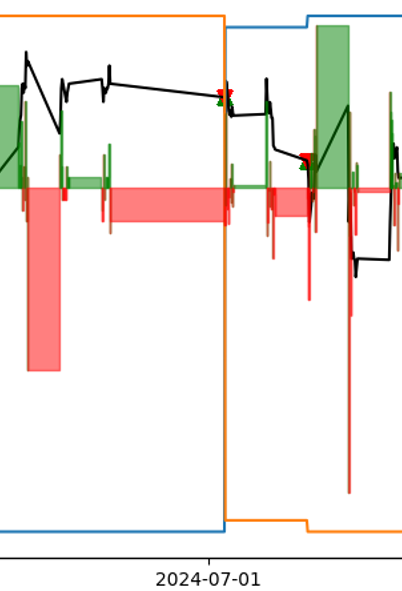
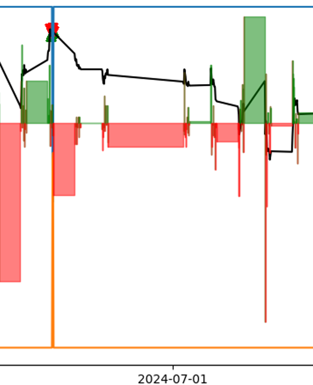

# CIR 모델과 z-score 산출을 이용한 변동성 낙폭을 줄인 페어 트레이딩 전략
> 유민우

# Pair trading strategy that reduces volatility drop using CIR model and z-score calculation
> Minwoo Yu

# 국문 초록

하락하는 시장에서 앞으로의 현물 가격을 simulate하고 OU 매개변수 추정을
통해 z-score를 산출하여 페어 트레이딩을 진행한다. CIR 모델과 OU 모델의
혼용은 상승하거나 하락하는 시장 모두에게서 최적의 매매 타이밍을 제공할
수 있으며 더욱이 이익은 극대화할 수 있고 손실을 최소화하는 것은 추세를
예측하는 딥러닝 모델보다 효과가 나았다.

# I.  연구의 필요성 및 구현

## 연구의 필요성

### 1\) 변동성이 큰 시장에서 살아남기 위한 전략

CIR 모델은 초기 asset price에 대한 simulation을 제공한다. 이 데이터를
바탕으로, 두 자산 간의 z-score를 산출하여 매매 signal을 생성하게 하면,
변동성이 큰 금융 시장에서 최적의 매매 시점을 포착하는 데에 중요한 의의를
가진다.

### 2\) 부족한 딥러닝 모델에 대한 보완

페어 트레이딩은 자산에서 두 주식 간의 보유 비중을 달리하면서 수익을 내는
구조를 가지고 있다. 이때 자산 둘 모두의 가치 추세가 하락하고 있다면,
자산에 대한 손실을 막을 수 없다. 하지만 어느 하나의 자산의 가치가
조금이라도 오른다면 그것에 대해 이득을 얻을 수 있다. 하지만 딥러닝 모델
또는 시계열 모델 등으로 구성하여 매매 signal을 조정할 때는, 각 자산 별
90% 이상의 일관된 정확도를 얻기 어려웠다.

하지만 CIR 모델의 가격 simulation을 통하여 그것을 바탕으로 z-score를
매긴다면 미래에 일어날 수 있는 모든 가능성에 대한 signal을 집합시킬 수
있으며, 페어 트레이딩의 자산 비중 변경 속도 또한 증가할 것이다.

machine learning 모델을 이용하면서 얻는 느린 속도 또한 덜 수 있으며,
실험적으로 test한 결과 다른 signal 조정 기능을 덜어내어 거래 비용 또한
감소하는 효과를 볼 수 있다.

## 구현

### 1\) 데이터 준비

모든 자산 가격 데이터들은 Min-Max로 normalize 한다. 정규화된 자산
데이터는 30분 간격의 가격으로, 정규 시장 -- 시간 외를 제외한 -- 380분을
30분으로 나눈 몫만큼의 길이($N$)가 필요하다.

### 2\) 모델 최적화

CIR 모델을 통한 초기 자산 가격 기준 시뮬레이션을 작동시키기 위해
MLE(최대 우도 측정)을 통하여 $\theta$와 $\sigma$를 최적할 필요가 있다.

### 3\) z-score 산출을 통한 매매 signal 생성

MLE(최대 우도 측정)을 통해 최적화한 매개변수를 바탕으로 CIR simulation
process를 각 자산 별로 가동한다. 예측되는 자산 가격은 다음과 같이
구해진다. $dW$ 는 브라운 운동에 따른 random 값이다.

$$X_{i} = X_{i - 1} + \theta(\mu - X_{i - 1}) \bullet dt + \sigma\sqrt{X_{i - 1}} \bullet {dW}_{i}$$

각각 N개의 자산 simulation 결과가 생기는데, 이것을 바탕으로 OU 모델
하에서 매개변수를 추정하고 z-score를 산출한다. 매개변수를 추정하고
z-score를 산출하는 과정은 다음과 같다.

$$\theta = - \ln(1 + \beta),\ \mu = \frac{\alpha}{1 - \exp( - \theta)}\ ,\ \sigma = \sqrt{\frac{2\theta}{1 - \exp( - 2\theta)}} \bullet std(\varepsilon)$$

$\beta$와 $\alpha$, $\varepsilon$은 각각 스프레드에 대한 회귀 모형의
기울기, 절편, 잔차다. 매개변수를 추정하였다면, 매매 signal을 생성할 수
있다.

$$z\, = \,\frac{p_{1} - p_{2} - \mu}{\sigma}$$

일반적으로 z-score가 --1 미만이라면 첫 번째 자산을 매수하고 두 번째
자산을 매도한다. 1을 초과한다면 첫 번째 자산을 매도하고 두 번째 자산을
매수한다. 만약 z-score의 절댓값이 0.5 미만이라면 모든 자산을 청산하는
것이 최적이다.

# II. 성능 측정

## 상승 종목에 대한 전략 비교

### 1\) 전략1

CIR 모델로 simulation 하지 않고 z-score를 측정하며, 추세 포착을 위해
1개의 MLP 모델과 1개의 ARIMA 모델이 가동된다. 이를 통해 z-score를
기반으로 모델에서 매겨진 다른 점수들로 매매 비율을 조정한다.

### 2\) 결과

상관관계가 매우 높은 종목 중에서 상승하는 종목을 선정하였다. 2024-06-11
\~ 2024-08-01 동안의 backtest이며, 329180.KS와 009540.KS이 선정되었다.

  |전략                   | 거래량            |수익률                 |샤프 지수|
|-------------------------|-----------------|---------------------|----------|
  |본문 전략            |   9  | 65.90%  | 1.44 |
  |전략 1          |        140      |         53.45%      |           1.29 |

거래량은 매우 적은 편이며 일일 거래를 하는 전략의 특성상 샤프 지수가
상당히 높으며, 수익률 또한 높다.

## 하락 종목에 대한 전략 비교

### 1\) 결과

비교 대상으로는 동일한 전략1이 사용되었으며, 기간은 동일하다. 선정된
종목은 하락하는 종목으로, 반도체 주식이며, 042700.KS와 000660.KS가
선정되었다.

  | 전략  |                  거래량    |         수익률     |             샤프 지수 |
  | ----------------------- | ------------------ | ----------------------- | --------------------- |
  |본문 전략               |   10    | -15.45%   | -0.59 |
  |전략 1                |  14       |          -28.78%      |           -1.12 |

하락하는 주식 쌍에 대해서는 거래량은 두 전략 모두 비슷하지만, 최적의
매매 타이밍이 하락하는 시장에서는 기다리는 것임이 반영되었을 때, 본문
전략이 더 우수하다.

## 포트폴리오 다각화 후 전략 비교

329180.KS와 009540.KS 쌍, 010140.KS와 010620.KS 쌍, 047040.KS와
130660.KS 쌍, 009540.KS와 012450.KS 쌍에 대한 2024년 6월 11일부터 2024년
8월 1일까지의 backtest를 진행하였다.

### 1\) 결과 비교

 본문 전략
 전략1

본문의 전략은 평균적으로 146%의 수익률을 내며, 변동폭은 --0.85%에서
168.38%다. 샤프 지수는 1.16으로 계산되었다. 전략1의 경우 평균적으로
125.45%의 수익률을 내며, 변동폭은 --0.69 %에서 139.03%다. 샤프 지수는
1.27으로 계산되었다.

# III. 손실 전환과 예방 차원에서의 성능

전략1은 추세 예측 딥러닝 모델과 ARIMA 시계열 모델을 이용하여 추세를
예측해 손실을 예측하고 매매 signal을 조정했다. 본문 전략은 단순히 CIR
모델의 simulate한 가격 데이터를 바탕으로 z-score를 측정한 것인데,
하락하는 주식에서 어떻게 손실을 예방하거나 이익으로 전환하는지 backtest
도구를 이용하여 살펴보겠다.

## 하락하는 주식 쌍에서의 수익률 그래프

 그림 3 본문 전략의 하락 추세 쌍에 대한 결과

어느 한 쪽의 주가라도 상승한다면 자산 역시 증가하며, 하락 추세에서는
주가의 반등 없이는 수익률은 음수를 기록한다. 주식 보유 비중의 전환
속도는 느린 편으로 기록되었다. 이러한 점이 주식의 추세에 크게 영향을
받아 자산 평가에 영향을 미친다. 결론적으로, 두 주식 중 상승하는 쪽에
자산 비중을 더 둔 점이 수익률 방어에 기여했다고 볼 수 있다.

 그림 4 전략1의 하락 추세 쌍에 대한 결과

수익률은 본문 전략보다 낮으며, 전환 속도 또한 매우 느리다. 페어
트레이딩에 대한 민감도가 매우 느려 상승하는 종목에 편승하지 못해
수익률은 저조하게 나타난다.

## 국소 변동 평가

 그림 6
 그림 5

\[그림 5\]를 보면 2024년 7월 1일 시점 부근에서 주식 보유 비중을 늘리거나
줄이지 않고 유지하면서 지속하는 하락 추세에 그대로 노출되었다. 하지만
\[그림 6\]에서는 하락 추세를 반영하여 주식별 보유 비중을 변경하였으며,
이로써 주식 쌍 내 개별 주식의 반등으로 인한 자산 증가 효과를 그대로
가져올 수 있었다.

이는 중장기적으로 상승 추세를 예측하더라도 단기간의 반등을 놓치는 추세
예측 모델의 약점이 반영된 것이라 할 수 있다.